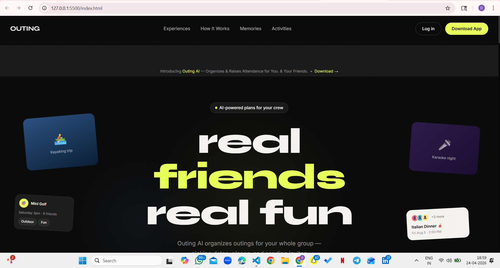
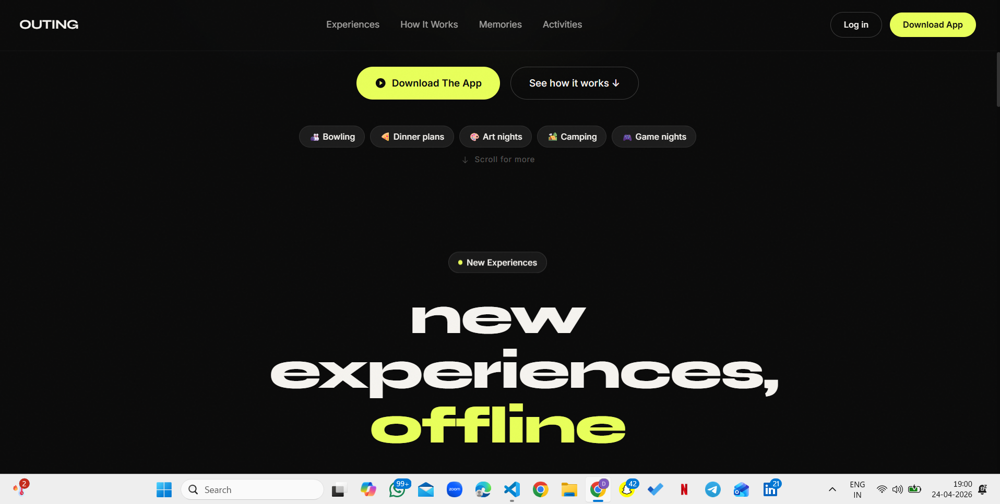
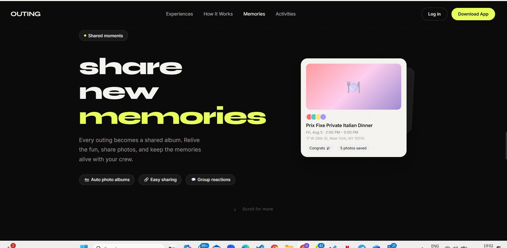
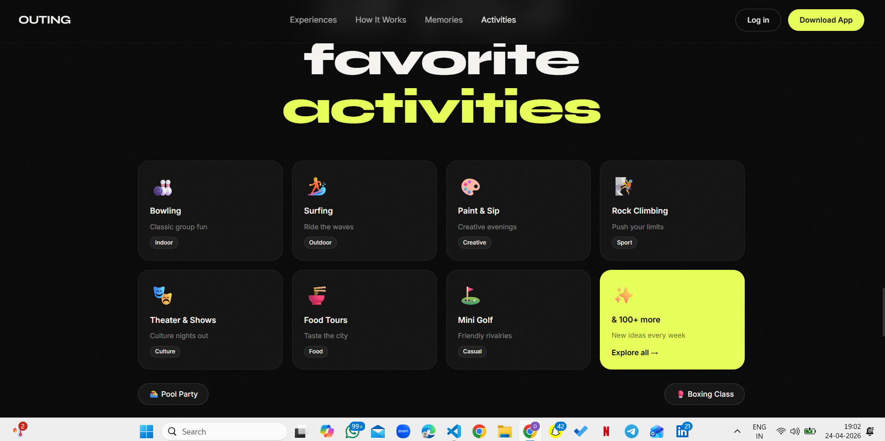
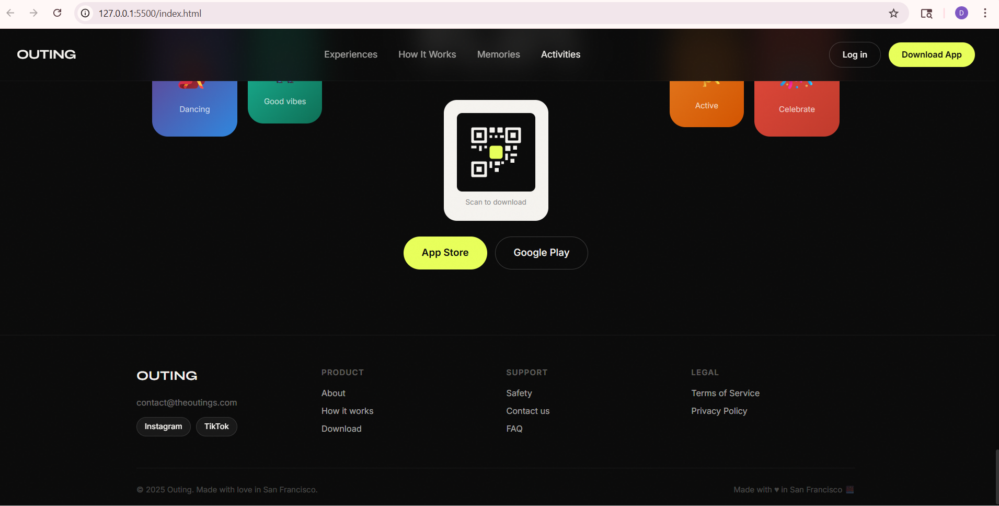

# 🚀 Outing Landing Page

A modern, premium landing page built with **HTML, Tailwind CSS, and smooth animations**.
Designed with a focus on clean UI, responsiveness, and engaging user experience.

---

## 🌐 Live Demo

🚧 Coming Soon (Will be deployed using GitHub Pages)

---

## 📸 Screenshots

### 🖥️ Desktop View



### 📱 Mobile View



### 🎯 UI Sections



### ✨ Animations & Layout



### 🎨 Design Details



---

## ✨ Features

* 📱 Fully Responsive Design
* 🎯 Smooth Scroll Animations
* 🎨 Modern UI/UX Design
* ⚡ Tailwind CSS Styling
* 🧩 Clean Layout & Structure
* 🔥 Interactive Elements

---

## 🛠️ Tech Stack

* **HTML5**
* **Tailwind CSS**
* **JavaScript**

---

## 📂 Project Structure

```
Outing/
│
├── index.html
├── README.md
├── website-review.md
├── screenshots/
│    ├── sc1gd.png
│    ├── sc2gd.png
│    ├── sc3gd.png
│    ├── sc4gd.png
│    ├── sc5gd.png
```

---

## 📊 UI/UX Audit

A detailed website analysis and improvement suggestions are included in:

👉 `website-review.md`

This includes:

* UI/UX issues
* Design improvements
* Accessibility fixes
* Responsiveness suggestions

---

## 🚀 How to Run Locally

1. Clone the repository

```
git clone https://github.com/your-username/your-repo-name.git
```

2. Open project folder

3. Run using Live Server (VS Code)

---

## 👩‍💻 Author

**Diya Sangar**
Computer Science Engineering Student
Chandigarh University

---

## ⭐ Support

If you like this project, give it a ⭐ on GitHub!

---
